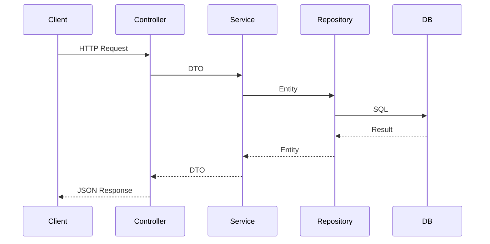

# Student Management System — Dokumentim (bazë për PDF)

## 1. Përshkrimi i projektit

**Student Management System** është një aplikacion REST që lejon regjistrimin, listimin, përditësimin dhe fshirjen e studentëve, si dhe eksportimin e listës në format Excel (`.xlsx`).

Projekti zhvillohet me praktika **Agile** (menaxhim detyrash në Jira), ndërtim **Maven multi-module**, integrim librarish moderne (Lombok, MapStruct, Apache POI), pipeline **Jenkins** dhe deploy në **OpenShift**.

## 2. Arkitektura

### 2.1 Shtresat (layered architecture)

```
┌─────────────────────────────────────────┐
│  web (REST Controllers)                 │
├─────────────────────────────────────────┤
│  service (Business Logic)               │
├──────────────┬──────────────────────────┤
│  repository  │  excel (POI Export)      │
├──────────────┴──────────────────────────┤
│  mapper (MapStruct)                     │
├─────────────────────────────────────────┤
│  model (JPA Entity)  │  dto (API DTO)   │
└─────────────────────────────────────────┘
```

### 2.2 Modulet Maven

| Modul | Përgjegjësi |
|-------|-------------|
| `model` | Entiteti `Student` me Lombok dhe JPA |
| `dto` | Objekte transferimi për API |
| `mapper` | Konvertim automatik Entity ↔ DTO |
| `repository` | `StudentRepository` (Spring Data JPA) |
| `service` | Rregulla biznesi, validime email |
| `excel` | Gjenerim skedari Excel me Apache POI |
| `web` | Spring Boot, kontrollerët REST |

### 2.3 Diagram i rrjedhës (CRUD)



## 3. Përdorimi i librarive

### Lombok
Redukton kod boilerplate (`@Getter`, `@Setter`, `@Builder`) në `Student` entity dhe klasat DTO.

### MapStruct
Gjeneron implementimin e `StudentMapper` në compile-time për mapim të sigurt dhe të shpejtë midis `Student`, `StudentDto`, `CreateStudentRequest`, `UpdateStudentRequest`.

### Apache POI
Moduli `excel` përdor `XSSFWorkbook` për të krijuar skedar `.xlsx` me header dhe rreshta studentësh.

### Spring Data JPA
Moduli `repository` ofron metoda `findAll`, `save`, `delete` dhe query custom për email unik.

## 4. Pipeline Jenkins

| Faza | Veprim |
|------|--------|
| Checkout | Pull nga Git |
| Build & Test | `mvn clean install` + JUnit |
| Archive | Ruaj `web-*.jar` si artifact |
| Docker (opsional) | Build imazh për OpenShift |

## 5. Deploy OpenShift

- **Dockerfile** multi-stage: Maven build + JRE 17
- **BuildConfig**: build automatik nga GitHub
- **Deployment** + **Service** + **Route** (URL publike HTTPS)
- **Health probes**: `/actuator/health`
- Udhëzues: [OPENSHIFT.md](OPENSHIFT.md)

## 6. Testimi

- **Unit**: `StudentServiceTest`, `StudentExcelExporterTest`
- **Integration**: `StudentControllerIntegrationTest` me MockMvc dhe H2

## 7. Konkluzion

Projekti plotëson kërkesat e kursit: CRUD, Excel export, multi-module Maven, libraritë e detyrueshme, teste JUnit, pipeline Jenkins dhe deploy në OpenShift.

---

*Konverto këtë dokument në PDF për dorëzim (Word, Pandoc, ose print-to-PDF).*
